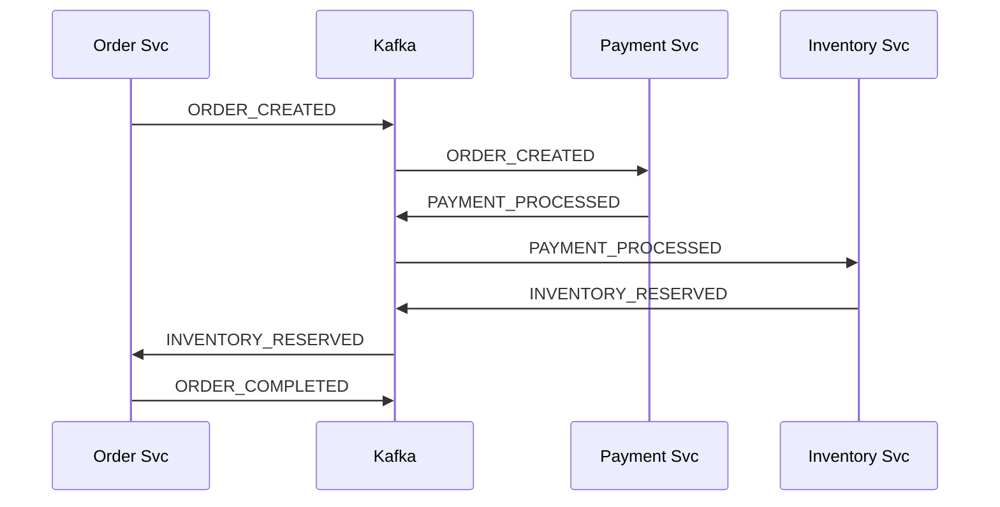
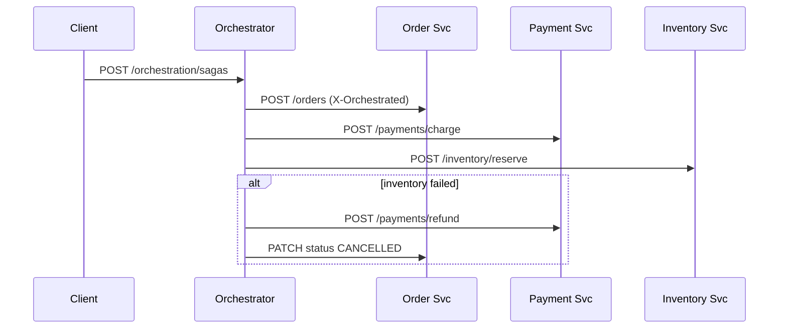

# Saga pattern demo (Python / FastAPI / Kafka)

Sample microservices showing **choreography** (event-driven) and **orchestration** (central coordinator) sagas. There is **no 2PC**: each service has its own SQLite database; consistency is reached via forward steps and **compensating transactions**.

## Architecture

| Service | Port (host) | Role |
|--------|-------------|------|
| **order-service** | 8000 | Orders, emits/consumes Kafka events, REST for reads |
| **payment-service** | 8001 | Charges / refunds, Kafka + REST `/payments/*` |
| **inventory-service** | 8002 | Stock reservation, Kafka + REST `/inventory/*` |
| **saga-orchestrator** | 8003 | Orchestration saga (REST-only flow + saga DB + `/event-log` viewer) |
| **Kafka** | 9092 | Topic `saga.choreography`, DLQ `saga.dlq` |
| **Zookeeper** | 2181 | For Confluent Kafka broker |

Shared library: `shared/saga_common` (events, Kafka helpers, JSON logging, retries, trace id).

```text
                     CHOREOGRAPHY (events)
  +-------------+     ORDER_CREATED      +---------------+
  |   Order     | --------------------->  |   Payment     |
  |  Service    |                         |   Service     |
  +-------------+                         +---------------+
        ^                                         |
        |              PAYMENT_PROCESSED          v
        |                                 +---------------+
        |   INVENTORY_RESERVED / etc.     |  Inventory    |
        +-------------------------------- |   Service     |
                                          +---------------+

                     ORCHESTRATION (REST)
               +----------------------+
               |  saga-orchestrator |
               +----------------------+
                   |     |      |
           (HTTP)  v     v      v
               Order  Pay   Inventory
               Service services
```

## Choreography vs orchestration

### Choreography (event-driven)

- **Who decides what happens next?** The **events** do. There is no central router.
- **Order service** `POST /orders` creates a row and publishes `ORDER_CREATED` to Kafka (**unless** header `X-Orchestrated: true`).
- **Payment** consumes `ORDER_CREATED`, publishes `PAYMENT_PROCESSED` or `PAYMENT_FAILED`.
- **Inventory** consumes `PAYMENT_PROCESSED`, publishes `INVENTORY_RESERVED` or `INVENTORY_FAILED`.
- If inventory fails after payment succeeded, **payment** consumes `INVENTORY_FAILED`, issues **refund**, publishes `PAYMENT_REFUNDED`.
- **Order** consumes `PAYMENT_*`, `INVENTORY_RESERVED`, `PAYMENT_REFUNDED` and updates its status; emits `ORDER_COMPLETED` / `ORDER_CANCELLED` where needed.



**ASCII (failure / rollback path)**

```text
INVENTORY_FAILED --> Payment (refund) --> PAYMENT_REFUNDED --> Order (CANCELLED)
```

### Orchestration (REST coordinator)

- **Who decides?** **saga-orchestrator** calls services in order: create order (with `X-Orchestrated: true`), charge payment, reserve inventory.
- Saga **state machine** and **step log** live in orchestrator SQLite (`/data/orchestrator.db`).
- On inventory failure after payment: orchestrator calls `POST /payments/refund`, then patches order status to `CANCELLED`.



## Rollback and compensation

- **Choreography:** refund is modeled as new domain events (`PAYMENT_REFUNDED`), not “undo” in the DB sense. Inventory failure triggers **compensating** refund in payment service.
- **Orchestration:** orchestrator invokes explicit **compensate** API (`/payments/refund`) and **order patch** to terminal state.

There is **no global lock** and **no two-phase commit**—only local commits plus messages.

## Reliability features (demo-level)

- **Correlation id:** `correlation_id` on orders and in every event; orchestrator uses `saga_id` as correlation for logs.
- **Idempotency:** `processed_events` table stores Kafka `event_id` to skip duplicates.
- **Retries:** consumer wrapper retries transient handler failures with **exponential backoff** (`saga_common.retry`).
- **DLQ:** after retries, failed raw payload goes to **`saga.dlq`** (`saga_common.kafka_bus.publish_dlq`).
- **Structured logs:** JSON logs with `correlation_id` (`saga_common.logging_conf`).
- **Tracing (light):** `X-Trace-Id`-style id returned on orchestrated sagas (`saga_common.trace`).

## Failure simulation

- **Environment (Docker Compose):** `PAYMENT_FAILURE_RATE`, `INVENTORY_FAILURE_RATE` on the respective services (`0.0`–`1.0`).
- **Runtime (REST):**
  - `POST /simulate/failures` on **saga-orchestrator** with JSON body, e.g.  
    `{"payment_failure_rate": 0.4, "inventory_failure_rate": 0.4}`
  - Or per service:
    - `POST /admin/failure-rate` on **payment-service** `{ "rate": 0.3 }`
    - `POST /admin/failure-rate` on **inventory-service** `{ "rate": 0.3 }`

## Main HTTP APIs

| Method | Service | Description |
|--------|---------|-------------|
| `POST /orders` | order | Start **choreography** (Kafka) unless `X-Orchestrated: true` |
| `GET /orders/{id}` | order | Order status |
| `PATCH /orders/{id}/status` | order | Internal; requires `X-Orchestrated` (used by orchestrator) |
| `POST /payments/charge` | payment | Orchestration charge |
| `POST /payments/refund` | payment | Orchestration refund |
| `POST /inventory/reserve` | inventory | Orchestration reserve |
| `POST /orchestration/sagas` | orchestrator | Start **orchestration** saga |
| `GET /orchestration/sagas/{saga_id}` | orchestrator | Saga state + step log |
| `GET /event-log` | orchestrator | Minimal HTML viewer |

## Run with Docker Compose

```bash
cd "Microservices - Saga"
docker compose up --build
```

Wait until Kafka is healthy (first start can take a minute). Then:

**Choreography (Kafka):**

```bash
curl -s -X POST http://localhost:8000/orders \
  -H "Content-Type: application/json" \
  -d '{"customer_id":"u1","items":[{"sku":"SKU-DEMO","qty":1}],"amount_cents":2500}'
```

**Orchestration (REST saga):**

```bash
curl -s -X POST http://localhost:8003/orchestration/sagas \
  -H "Content-Type: application/json" \
  -d '{"customer_id":"u1","items":[{"sku":"SKU-DEMO","qty":1}],"amount_cents":2500}'
```

## Local Python (without Docker)

Requires a running Kafka on `localhost:9092` for choreography consumers/producers.

```bash
python3 -m venv .venv
source .venv/bin/activate
pip install ./shared
pip install -r order_service/requirements.txt   # repeat for other services as needed
export KAFKA_BOOTSTRAP_SERVERS=localhost:9092
export DATABASE_PATH=/tmp/order.db
uvicorn app.main:app --app-dir order_service
```

Run each service in its own terminal with its own `DATABASE_PATH`.

## CLI helper (bonus)

```bash
./scripts/saga_demo.py choreography
./scripts/saga_demo.py orchestration
./scripts/saga_demo.py status <order_id>
./scripts/saga_demo.py saga <saga_id>
```

Toggle **mode** by choosing **choreography** (order service) vs **orchestration** (orchestrator) commands.

## Order status values

`CREATED` → `PAYMENT_COMPLETED` → `INVENTORY_RESERVED` → `COMPLETED`, or terminal `FAILED` / `CANCELLED` (after compensation).

## Project layout

```text
shared/saga_common/     # Events, Kafka publish, consumer loop, logging, retry, trace
order_service/app/       # FastAPI + SQLite + Kafka consumer/producer
payment_service/app/
inventory_service/app/
saga_orchestrator/app/   # Orchestration engine + SQLite saga log
scripts/saga_demo.py
docker-compose.yml
```

## License

Sample code for learning; use and modify freely.
